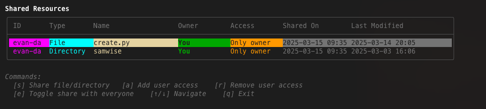
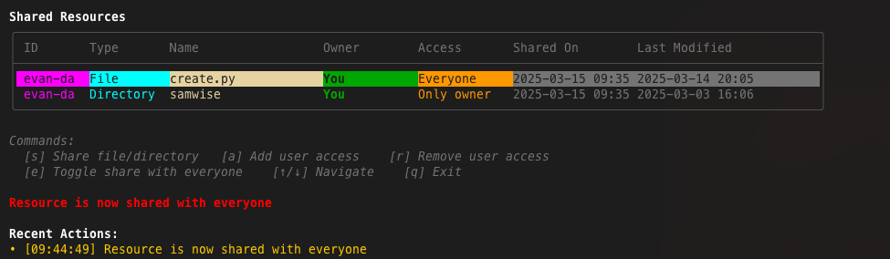

# LAN Sharing Service
A local-area-network (LAN) sharing service that shares files and clipboards across different devices in local area network, essientially, it means transferring files directly between devices on the same network without going through the internet. 


## CUJ
- *CUJ#1:* sub LAN with access code;
- *CUJ#2:* peer discoveries (in LAN and sub-LAN);
- *CUJ#3:* access level (secured mode, admin, visitor, ...);
- *CUJ#4:* messages transmission & history (text only);
- *CUJ#5:* file transmission (different format);

## Prerequisite
First, make a new folder and clone the repo:
```sh
mkdir lanss && cd lanss
git clone git@github.com:amyhuang95/LAN-Sharing-Service.git
cd LAN-Sharing-Service
```

download all python dependencies:

```
pip install -r requirements.txt
```
**Notes: Make sure all the device are in the same LAN to discover your peers.**

## Start
Create a user with `username = evan-dayy`. Add `--share_clipboard` or `-sc` flag to activate clipboard sharing feature.
```sh
python create.py create --username <USERNAME> --port <OPTIONL>
```
Type `help` to see the LAN Terminal command;
```
╔═════════════════════════════ LAN Share Service ══════════════════════════════╗
║ Welcome to LAN Share, evan-dayy#b598!                                        ║
║                                                                              ║
║ • Share files and directories on your local network                          ║
║ • Chat with other users on the same network                                  ║
║ • Share clipboard contents securely                                          ║
║                                                                              ║
║ Type help for available commands                                             ║
║ Press Tab to autocomplete commands, usernames, and file paths                ║
╚════════════════════════ Connected as evan-dayy#b598 ═════════════════════════╝
evan-dayy#b598@LAN(192.168.4.141)# help
╭──────────────────────── LAN Share Command Reference ─────────────────────────╮
│ ╭───────────┬──────────────────────────────┬───────────────────────────────╮ │
│ │ Command   │ Description                  │ Usage Example                 │ │
│ ├───────────┼──────────────────────────────┼───────────────────────────────┤ │
│ │ ul        │ List online users            │ ul                            │ │
│ │ msg       │ Send a message to a user     │ msg username                  │ │
│ │ lm        │ List all message             │ lm                            │ │
│ │           │ conversations                │                               │ │
│ │ om        │ Open a specific conversation │ om conv_id                    │ │
│ │ share     │ Share a file or directory    │ share ~/Documents/file.txt    │ │
│ │ files     │ List and manage shared files │ files                         │ │
│ │ access    │ Manage access to shared      │ access resource_id username   │ │
│ │           │ resources                    │ add|rm                        │ │
│ │ all       │ Share resource with everyone │ all resource_id on|off        │ │
│ │ clipboard │ Activate/deactivate          │ clipboard on|off              │ │
│ │           │ clipboard sharing            │                               │ │
│ │ sc        │ Add peers to share clips to  │ sc to|from username add|rm    │ │
│ │           │ or receive clips from        │                               │ │
│ │ registry  │ Manage registry connection   │ registry connect              │ │
│ │           │ for restricted networks      │ 192.168.1.5:5000              │ │
│ │ debug     │ Toggle debug mode            │ debug                         │ │
│ │ clear     │ Clear screen                 │ clear                         │ │
│ │ help      │ Show this help message       │ help                          │ │
│ │ exit/quit │ Exit the application         │ exit                          │ │
│ ╰───────────┴──────────────────────────────┴───────────────────────────────╯ │
╰──────────────────────────────────────────────────────────────────────────────╯
╭──────────────────────────────────────────────────────────────────────────────╮
│                                                                              │
│ TIP: Press Tab to autocomplete commands, usernames, and file paths.          │
│                                                                              │
╰──────────────────────────────────────────────────────────────────────────────╯

```
## Peer Discovery & Message Exchange Commands

### List all online users
```
evan-dayy#07a8@LAN(192.168.4.141)# ul
```

### Real-time Message Exchange with a Peer
```
evan-dayy#07a8@LAN(192.168.4.141)# msg jennifer#6423432  --send a message
evan-dayy#07a8@LAN(192.168.4.141)# lm                    --list all message
evan-dayy#07a8@LAN(192.168.4.141)# om <message id>       --open a message
```


## File Sharing Commands

These commands show all the basic usages on how to share a file or directory with a peer, however, there are some important features doesn't show here, here are the summary we provide on file sharing features:
- Share a file or directory to everyone;
- Almost all types of files - including pdf, scripts, pictures, even videos
- Give/Remove certain user an access to a file or directory;
- **Auto-sync**: The update in the host file or directory will be synced to peers;
- Access Provision & Deletion during new peers emerge or quit;
- An Interactive UI to easily interact with the files sharing;

### Share `share <path to a [file|directory]>`
```
evan-dayy#208b@LAN(192.168.4.141)# share ./create.py
╭───────────────────────────────────── ✓ Share Successful ──────────────────────────────────────╮
│ Successfully shared file: ./create.py                                                         │
│ Resource ID: evan-dayy#208b_1742673990_create.py                                              │
│                                                                                               │
│ By default, only you can access this resource.                                                │
│ Use access <resource_id> <username> add to give access to others.                             │
│ Or use all <resource_id> on to share with everyone.                                           │
╰───────────────────────────────────────────────────────────────────────────────────────────────╯
```
- You can share any file (including video or images) or directory (including recusive directory) by using this command;
- The path can be any format - including relative path or absolute path;
- All shared file will be stored in a the home directory folder called shared, and each peer should has its own shared folder.
```
lanshare
    |____shared
            |____evan-dayy#07a8
            |____jennifer#24fs
            |____(other peers folder that contained shared files)
```

### Show all shared files `files`
```
evan-dayy#07a8@LAN(192.168.4.141)# files
```


- There are some sub-commands listed in the view, press `e` to in this view to quickly give acccess to everyone;



### Access Command `access <resource_id> <user_id> [add|rm]` 
```
evan-dayy#208b@LAN(192.168.4.141)# access
╭──────────────────────────────────────── Command Help ─────────────────────────────────────────╮
│ Usage: access <resource_id> <username> add|rm                                                 │
╰───────────────────────────────────────────────────────────────────────────────────────────────╯
evan-dayy#208b@LAN(192.168.4.141)# access evan-dayy#208b_1742673990_create.py jennifer#b903 add
✓ Successfully added to access list for jennifer#b903
evan-dayy#208b@LAN(192.168.4.141)# access evan-dayy#208b_1742673990_create.py jennifer#b903 rm
✓ Successfully removed from access list for jennifer#b903
```

### `all` Command `all <resource_id>` 
```
evan-dayy#208b@LAN(192.168.4.141)# all evan-dayy#208b_1742673990_create.py
╭──────────────────────────────────────── Command Help ─────────────────────────────────────────╮
│ Usage: all <resource_id> on|off                                                               │
╰───────────────────────────────────────────────────────────────────────────────────────────────╯
evan-dayy#208b@LAN(192.168.4.141)# all evan-dayy#208b_1742673990_create.py on
✓ Resource is now shared with everyone
evan-dayy#208b@LAN(192.168.4.141)# all evan-dayy#208b_1742673990_create.py off
✓ Resource is now no longer shared with everyone
```


## Clipboad Sharing Commands
```
evan-dayy#208b@LAN(192.168.4.141)# clipboard
╭──────────────────────────────────────── Command Help ─────────────────────────────────────────╮
│ Usage: clipboard on|off                                                                       │
╰───────────────────────────────────────────────────────────────────────────────────────────────╯
evan-dayy#208b@LAN(192.168.4.141)# sc
╭──────────────────────────────────────── Command Help ─────────────────────────────────────────╮
│ Usage: sc to|from <username> add|rm                                                           │
╰───────────────────────────────────────────────────────────────────────────────────────────────╯
evan-dayy#208b@LAN(192.168.4.141)#
```

## Registry Server Mode
```
python registry_server.py --port 5050
```

```
evan-dayy#208b@LAN(192.168.4.141)# registry
╭─────────────────────────────────────── Registry Status ───────────────────────────────────────╮
│ Not using registry server. Currently in UDP broadcast discovery mode.                         │
│                                                                                               │
│ To connect to a registry server, use: registry connect <server_url>                           │
│ Example: registry connect 192.168.1.5:5000                                                    │
╰───────────────────────────────────────────────────────────────────────────────────────────────╯

evan-dayy#208b@LAN(192.168.4.141)# registry connect 192.168.4.141:5050
Connecting to registry server at 192.168.4.141:5050...
✓ Successfully registered with registry server
Now discovering peers via both UDP broadcast and registry server
```

```
╭────────────────────── Active Peers: 1 ───────────────────────╮╭────── Server Statistics ──────╮
│                      Online Peers                            ││ ╭─────────────────┬────────╮  │
│ ╭────────────────┬───────────────┬───────┬───────────╮       ││ │ Registrations   │ 0      │  │
│ │ Username       │ IP Address    │ Port  │ Last Seen │       ││ │ Unregistrations │ 0      │  │
│ ├────────────────┼───────────────┼───────┼───────────┤       ││ │ Heartbeats      │ 5      │  │
│ │ evan-dayy#208b │ 192.168.4.141 │ 12345 │ 8s ago    │       ││ │ Peer Requests   │ 95     │  │
│ ╰────────────────┴───────────────┴───────┴───────────╯       ││ │ Uptime          │ 1m 14s │  │
│                                                              ││ ╰─────────────────┴────────╯  │
│                                                              ││                               │
│                                                              ││                               │
╰──────────────────────────────────────────────────────────────╯╰───────────────────────────────╯
```
