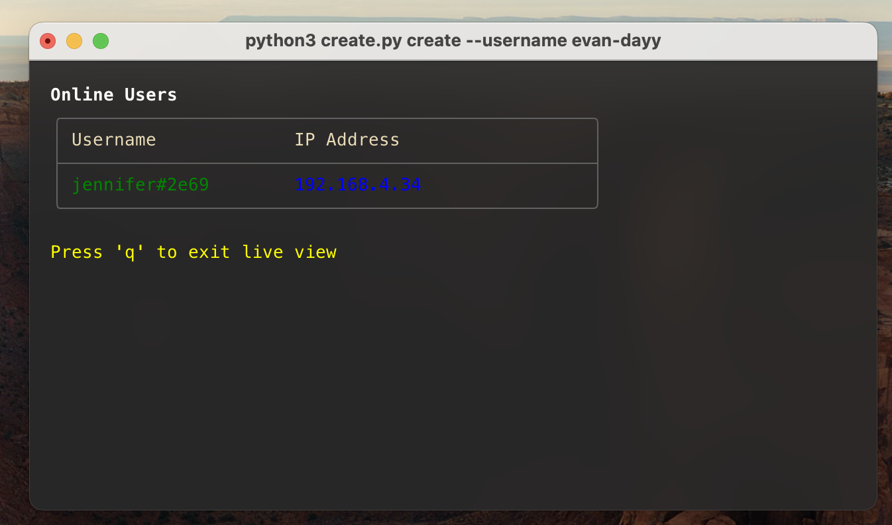
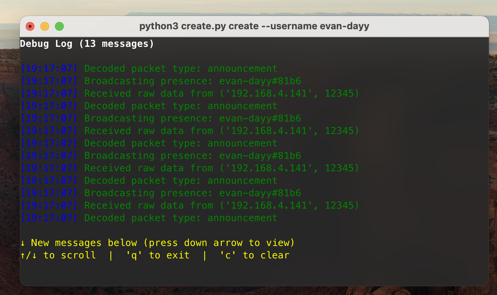
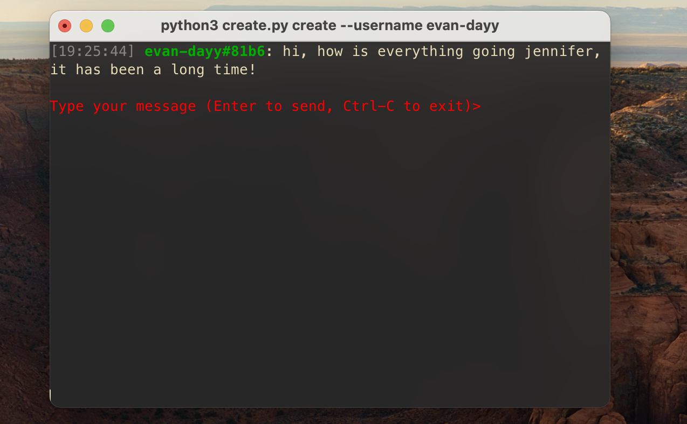
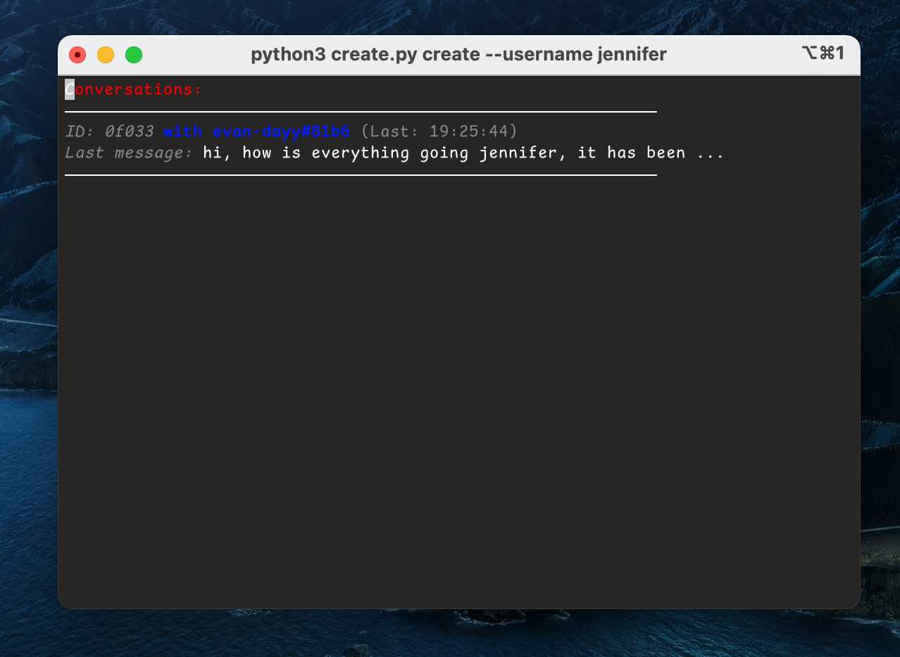
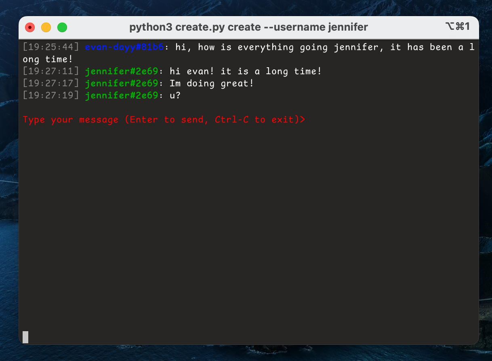
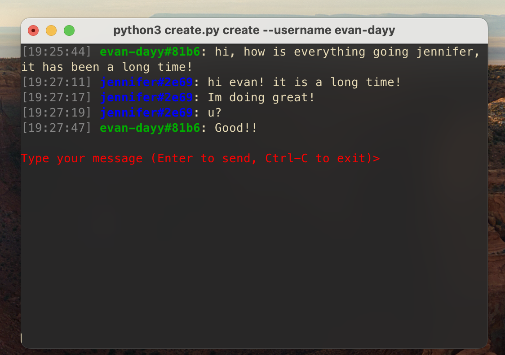

# LAN Sharing Service
A local-area-network (LAN) sharing service that shares files and clipboards across different devices in local area network, essientially, it means transferring files directly between devices on the same network without going through the internet. 

### CUJ
---
- *CUJ#1:* sub LAN with access code;
- *CUJ#2:* peer discoveries (in LAN and sub-LAN);
- *CUJ#3:* access level (secured mode, admin, visitor, ...);
- *CUJ#4:* messages transmission & history (text only);
- *CUJ#5:* file transmission (different format);
- *CUJ#6:* streaming across LAN;
- *CUJ#7:* backup and restore;

### Prerequisite
---
First, make a new folder and clone the repo:
```sh
mkdir lanss && cd lanss
git clone git@github.com:amyhuang95/LAN-Sharing-Service.git
cd LAN-Sharing-Service
```

download all python dependencies:

```
pip install -r requirements.txt
```
**Notes: Make sure all the device are in the same LAN to discover your peers.**

### Create a User with `username`
---
Create a user with `username = evan-dayy`.
```sh
python create.py create --username <USERNAME>
```

Access to the LAN Terminal command;
```

Welcome to LAN Share, evan-dayy#81b6!
Type 'help' for available commands
evan-dayy#81b6@LAN(192.168.4.141)# help

Available commands:
  ul     - List online users
  msg    - Send a message (msg <username>)
  lm     - List all messages
  om     - Open a message conversation (om <conversation_id>)
  debug  - Toggle debug mode
  clear  - Clear screen
  help   - Show this help message
  exit   - Exit the session
evan-dayy#81b6@LAN(192.168.4.141)#

```

### Demo
---
#### User List `ul`
By running `ul`, you will see a list of active user.

- pre-requisite: Create a user in another device called `jennifer`.
 
```
evan-dayy#81b6@LAN(192.168.4.141)# ul
```



#### Debug View `debug`

To easily track the received and sent packets, we explicitly design the `debug view` to monitor the traffic. This also give us convenience when we implement other service for later iterations.

```
evan-dayy#81b6@LAN(192.168.4.141)# debug
```



#### Message View `om`, `lm`, `msg`
Let's text to Jennifer:
```
evan-dayy#81b6@LAN(192.168.4.141)# msg jennifer#2e69
```


From Jennifer point of view to list message `lm`:
```
jennifer#2e69@LAN(192.168.4.34)# lm
```


From Jennifer point of view to open message `om` and reply:
```
jennifer#2e69@LAN(192.168.4.34)# om 0f033
```


From Evan point of view:

